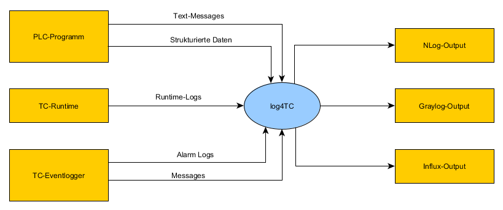
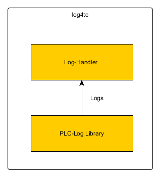

# Beschreibung

## Produktsicht

*Log4tc* ist eine Erweiterung der TwinCAT-Runtime, bestehend aus einer TwinCAT-PLC-Library, die der PLC-Programmierer in seinen Code integriert und einem Windows-Service der auf den gleichen oder im Fall eines ARM-Rechners auf einem anderen Rechner installiert wird.

Die PLC-Library stellt Funktionen zur Verfügung um an definierten Stellen im Programm Daten zu Erzeugen. Die Daten können im einfachsten Fall eine unstrukturierte Log-Meldung sein, aber auch stark strukturierte Informationen zur automatisierten Weiterverarbeitung wie beispielsweise nummerische Werte einer Zeitreihe.

Die in der PLC anfallenden Daten werden in einen nicht-Echtzeit-Context übertragen und dort über einen Plugin-Mechanismus weitergegeben. Dieser Mechanismus soll sicherstellen, dass eine grosse Anzahl an Ausgaben abgedeckt werden kann, wie z.B. NLog, Graylog, Influx, usw. Die Auswahl der Ausgabe erfolgt über Konfigurationsdateien.

Das System stellt Erweiterungsmöglichkeiten in Form von API-Schnittstellen zur Verfügung, um neue Anforderungen ins Besondere bei der Ausgabe integrieren zu können.

Es bietet sich an, von System anfallende Daten mit in den Benutzer generierten Daten zu integrieren. Hierzu zählen das TwinCAT-Log sowie die TwinCAT Eventlogger (V1 und V2).

Ziel des *log4tc* ist es für Entwickler, Operatoren und Benutzer eine Möglichkeit zu schaffen Fehler, Abläufe, Audits usw. zu verfolgen, aufzuzeichnen und darauf reagieren zu können, ohne die TwinCAT-XAE Entwicklungsumgebung nutzen zu müssen.

Das *log4tc* besteht aus zwei Komponenten.

Mit der *PLC-Log Library* kann der PLC-Programmierer Daten aus dem SPS-Programm heraus senden. Diese werden dann über einen internen Mechanismus an den *Log-Handler* weitergegegben, der diese dann an eine konfigurierte Ausgabe weitergibt.

### System Schnittstellen

Das *log4tc* besitzt folgende Schnittstellen zum TwincAT-System:
* TwinCAT-Logger: Nimmt Log-Meldungen der TwinCAT-Runtime entgegen und sendet diese an die Ausgabe.
* TwinCAT-Eventlogger (V1): Die Statusänderungen von Alarmen entgegen und sendet diese and de Ausgabe.
* TwinCAT-Eventlogger2: Wie bei TwinCAT-Eventlogger
* TwinCAT-ADS: *log4tc* benutzt für die interne Kommunikation das ADS-Protokoll.

### Benutzerschnittstellen

*Log4tc* besitzt keine grafischen oder textuellen Schnittstellen. Für die Ausgabe existiert einzige eine Konfigurationsdatei, die vom Benutzer angepasst werden kann.

### Hardwareschnittstellen

*Log4tc* ist ein reines Softwaresystem ohne HW-Anbindung.

### Softwareschnittstellen

*Log4tc* definiert folgende Softwareschnittstellen (API):
* PLC-Library: API für das erzeugen von Log-Meldungen
* Output-API: API für das ankoppeln von Output-Plugins an den Log-Handler.

### Kommunikationsschnittstellen

*Log4tc* besitzt keine nach aussen sichtbaren Kommunikationsschnittstellen.

## Benutzer und Profile

### Rolle: PLC-Programmierer

Programmiert die SPS und integriert damit das *log4tc* in das SPS-Programm. Ist ausserdem zuständig, dass die richtigen Log-Meldungen mit passenden Inhalten abgesetzt wird.

Kennt TwinCAT und PLC-Runtime. Ist mit dem Windows-Betriebssystem vertraut.

### Rolle: Betrieb und Unterhalt

Ist für den fehlerfreien Betrieb der Anlage zuständig und hilft bei Problemen in der 1. Instanz.

Kennt die Anlage vom Betrieb her. Hat eingeschränkte TwinCAT Erfahrung. Bringt grundlegende Windows Erfahrungen mit.

### Rolle: Service Auftragnehmer

Ist für den Aftersale-Service einer Anlage vorhanden. Hilft den Kunden in 2. Instanz bei Problemen.

Kennt TwinCAT und PLC-Runtime. Ist mit dem Windows-Betriebssystem vertraut. Hat Zugriff auf das PLC-Programm.

### Rolle: IT Kunde

Ist zuständig für den Betrieb und Sicherheit der Anlage. Hilft bei Systemproblemen wie Windows-Abstürzen, Rechnertausch etc.

Hat keine TwinCAT Erfahrung, kennt aber das Windows-Betriebsystem sehr gut.

## Einschränkungen

### Technische Einschränkungen

Log4tc setzt intern auf ADS auf und ist damit den Einflüssen dieser Kommunikation ausgesetzt. Im Besonderen können beim Übergang von Echtzeit auf nicht-Echtzeit Beschränkungen hinsichtlich der zu verarbeitenden Datenmenge auftreten.

