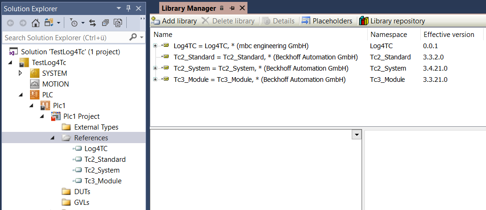

# log4TC Library zum SPS-Projekt hinzufügen

## Library als Referenz hinzufügen

Die log4TC-Library wird mit der Installation als SPS-Library registriert und muss noch in das Projekt eingebunden werden:

1. Doppelklick auf Order *References* im SPS-Projekt -> *Library Manager* wird geöffnet
1. "Add library" anwählen
1. Im Dialog den Suchtext "log4tc" eingeben; In der Liste sollte die Library "Log4TC" erscheinen
1. Doppelklick auf "Log4TC"

Die Referenzen sollte wie folgt aussehen (Versionnummer kann variieren):

## Nächster Schritt

[Ausgabe einer einfachen Log-Meldung](simple_logging.md)

