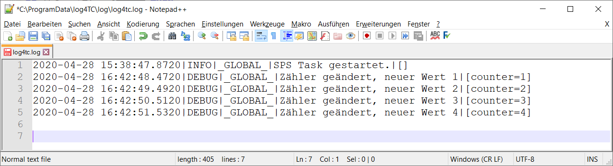

# Ausgabe von Log-Meldungen mit Argumenten

Log4TC erlaubt es nicht nur konstante Log-Message auszugeben, sondern auch Argumente mitzugeben. Ein wichtiges Konzept dabei ist die Unterstützung von Struktured-Logging, d.h. die Argumente werden nicht nur einfach in den Text integriert, sondern stehen für verschiedene Ausgaben als ursprüngliche Daten zur Verfügung.

Log4TC erlaubt es Argumente auf verschiedene Arten zu übergeben. Da TwinCAT keine Funktionsüberladungen unterstützt gibt es für jede Anzahl an Argumenten (von 0 bis 10) eine eigene Funktion.

## Ausgabe von Argumenten mit ANY-Typ

Argumente werden mit dem ST-Datentype `ANY` übergeben werden. Einzige Voraussetzung dafür ist, dass der Wert als Variable vorliegt, als kein konstanter Wert und kein Ausdruck.

Im Beispiel wird ein Zähler erzeugt, der jede Sekunde um eins hochzählt:

```
VAR
	nCounter	: UINT;
	fbCountTime	: TON := (PT:=T#1S);
END_VAR
----------------------------------------------------------------------
fbCountTime(IN:=NOT fbCountTime.Q);
IF fbCountTime.Q THEN
	nCounter := nCounter + 1;
END_IF
```

Als nächstes wird bei jeder Änderung des Zählers eine Meldung in das Log-File geschrieben. Dazu wird der Logger im `IF/THEN` aufgerufen und der aktuellen Zählerwert übergeben:

```
F_LogA1(E_LogLevel.eDebug, 'Zähler geändert, neuer Wert {0}', nCounter);
```

Da ein Argument vom Typ `ANY` übergeben wird, heisst die Funktion `F_LogA1`. Gegenüber `F_Log` besitzt diese einen weiteren Input-Parameter mit dem der aktuelle Zählerwert übergeben wird.

Damit der Zähler-Wert auch im Text erscheint, wird ein Platzhalter `{0}` in der Log-Message gesetzt ([Platzhalter](../reference/placeholder.md)). Im Beispiel wird dieser Platzhalter bei der Ausgabe durch den Wert der Variable `nCounter`ersetzt. Nach den gleichen Muster können auch weitere Parameter angegeben werden.

Der komplette MAIN-Code sieht damit wie folgt aus:

```
IF _TaskInfo[GETCURTASKINDEXEX()].FirstCycle THEN
	F_Log(E_LogLevel.eInfo, 'SPS Task gestartet.');
END_IF

fbCountTime(IN:=NOT fbCountTime.Q);
IF fbCountTime.Q THEN
	nCounter := nCounter + 1;
	F_LogA1(E_LogLevel.eDebug, 'Zähler geändert, neuer Wert {counter}', nCounter);
END_IF

PRG_TaskLog.Call();
```

## Aktualisieren des SPS-Codes und beobachten der Log-Meldung

Der geänderte SPS-Code kann jetzt mit einem Online-Change aktualisiert werden. Danach kann man im Log-File jede Sekunden den neuen Zählerwert ablesen.



## Nächster Schritt

[Benutzung von Loggern](logger_usage.md)


