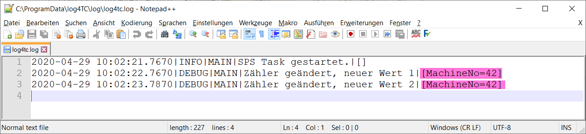

# Integration von Context-Eigenschaften

Für log4TC sind Log-Meldungen mehr als simple Strings die die Textdateien geschrieben werden. Jede Log-Meldung besteht aus einer variablen Anzahl von zwingend und optionalen Eigenschaften. Context-Properties sind solche optionale Eigenschaften.

Context-Eigenschaften sind ein weiterführendes Thema und können beim ersten Kontakt mit log4TC übersprungen werden. Um aber vom Logging-System die maximalen Nutzen ziehen zu können, lohnt sich aber die Einarbeitung.

## Zweck der Context-Eigenschaften

Die Context-Eigenschaften einer Log-Meldungen ermöglichen es direkt und indirekt zusätzliche Daten einer Log-Message mitzugeben, zu Verarbeiten, Filtern und Auszugeben. Der Context ist sehr ähnlich zu Meldung Argumenten, mit dem Unterschied, dass sie nicht direkt in der Log-Meldung erscheinen müssen.

Der Context existiert auf vier Ebenen:

* Task
* Verschachtelter Context (Nested Context)
* (Logger) - momentan noch nicht implementiert
* Log-Message

In dieser Eiführung wird nur der letzte Typ beschrieben.

## Context-Properties für Log-Messages

Um einer Log-Message einen Context mitzugeben, muss hierfür eine neue Variante der `F_Log` Funktion verwendet werden: 

```
	F_LogLA1C(
		E_LogLevel.eDebug, 
		sLogger, 
		'Zähler geändert, neuer Wert {0}', 
		nCounter, 
		F_LogContext().AddInt('MachineNo', 42)
	);
```

In diesen Beispiel wird an die von den vorherigen Schritten bereits vorhandene Log-Meldung eine Context-Eigenschaft mit dem Namen *MachineNo* und den Wert *42* hinzugefügt.

## Log-Message

In der mitgelieferten Konfigurationsdatei werden die Context-Eigenschaften am Ende der Log-Meldung hinzugefügt:



## Nächster Schritt

[Log-Meldungen mit Log4View beobachten](tools_log4view.md)

