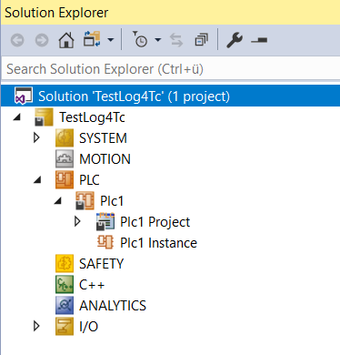

# TwinCAT Projekt anlegen

Um den Beispielen zu folgen, wird ein neues TwinCAT Projekt mit einem SPS-Projekt benötigt. Das Projekt muss für das Beispiel auf den gleichen Rechner aktiviert werden, auf dem auch log4TC installiert ist. Eine lokale Testlizenz ist ausreichend.

## Solution (TwinCAT Project) anlegen

1. Neues leeres TwinCAT XAE Projekt anlegen
1. Neues "Standard PLC Project" anlegen

Es müssen keine speziellen Einstellungen vorgenommen werden.

Die Visual Studio Solution sollte wie folgt aussehen:

## Nächster Schritt: 

[log4TC-Library hinzufügen](add_log4tc_lib.md)