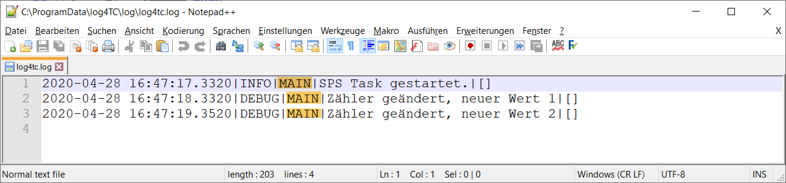

# Benutzung von Loggern

## Zweck von *Logger*

Rein technisch betrachtet ist ein *Logger* ein String-Wert für eine oder mehrere Log-Meldungen, das durch das gesamte Logging-System weitergereicht wird. Ein *Logger* kann daher z.B. von Filterplugins verwendet werden oder bei der Ausgabe mit geschrieben werden.

Wie genau und ob *Logger* benutzt werden kann vom Entwickler selbst definiert werden. Bei allen grösseren Projekten hat sich folgende Richtlinie als Vorteil erwiesen:

*Logger* kennzeichnen Bereiche einer Applikation, der Log-Meldungen zugeordnet werden. Ein Bereich einer Applikation ist ein Baustein, Methode, Namensraum (bei Libraries) die mit einem hierarchisch aufgebauten Namen gekennzeichnet werden. Die einzelnen Teile eines solchen Namens werden durch einen Punkt "." getrennt.

Beispiele:
* Eine Methode eines Libraries-Bausteins: `MyLib.PRG_Foo.Init` (`MyLib`=Librarynamen, `PRG_Foo`=Bautein, `Init`=Methode)
* Ein Baustein in einem Subsystem: `Communication.FB_Send` (`Communication`=Subsystem, `FB_Send`=Baustein)

Durch die hierarchiesche Gliederung können Log-Meldungen auch bei grossen Systemen mit hunderten oder tausenden Log-Meldungen schnell zugeordnet werden. Ebenso können z.B. auch einfach Meldungen eines Subsystems ausgefiltert oder in eine eigene Log-Datei umgeleitet werden.

## Wie werden Logger benutzt?

Alle Funktionen, die *Logger* unterstützten haben ein `L` im Namen:

* `F_Log` wird zu `F_LogL`
* `F_LogA1` wird zu `F_LogLA1`

Diese Funktionen haben an 2. Stelle eine zusätzlichen String-Inputparameter für den *Logger*. Wenn mehrere Log-Meldungen im gleichen Baustein ausgegeben werden, lohnt es sich eine Konstante dafür zu definieren. Der geänderte Code aus dem letzten Schritt sind mit *Logger* jetzt so aus:

```
VAR CONSTANT
	sLogger		: STRING := 'MAIN';
END_VAR
--------------------------------------------------------------
IF _TaskInfo[GETCURTASKINDEXEX()].FirstCycle THEN
	F_LogL(E_LogLevel.eInfo, sLogger, 'SPS Task gestartet.');
END_IF

fbCountTime(IN:=NOT fbCountTime.Q);
IF fbCountTime.Q THEN
	nCounter := nCounter + 1;
	F_LogLA1(E_LogLevel.eDebug, sLogger, 'Zähler geändert, neuer Wert {0}', nCounter);
END_IF

PRG_TaskLog.Call();
```

## Ausgabe im Log

Im Log-File wird der *Logger* in der zweiten Spalte ausgegeben:




## Was passiert wenn kein 'Logger' benutzt wird?

*Logger* sind ein integrierter Bestandteil von log4TC, aus diesen Grund wird intern immer ein *Logger* benutzt, auch wenn keiner angegeben wird. Der Logger in solchen Fällen ist in `Const.sGlobalLogger` definiert und hat den Wert `'_GLOBAL_'`.

## Nächster Schritt

[Integration von Context-Eigenschaften](context_usage.md)


