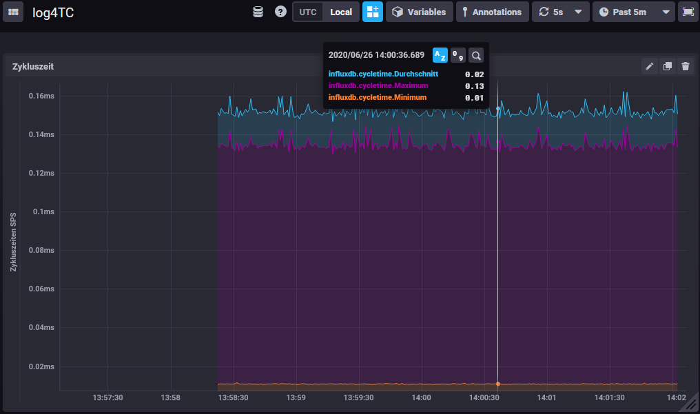

# Logging nach Influx

log4TC unterstützt verschiedene Ausgaben, bisher wurden die Meldungen zur *NLog*-Ausgabe weitergegeben. In diesen Beispiel werden Log-Meldungen in eine [Influx-DB](https://www.influxdata.com/) geschrieben, wo sie dann mit [Chronograf](https://www.influxdata.com/time-series-platform/chronograf/) als Graph visualisiert werden.

## Kurzeinführung Influx

InfluxDB ist eine Open-Source Datenbank, die spezialisiert ist auf die Verwaltung von Zeitreihendaten. Eine Zeitreihe enthält einen oder mehrere Werte (nummerisch oder string), die mit einem Zeitstempel und optionalen Tags abgespeichert werden. Eine einfache Zeitreihe ist z.B. der Temperaturverlauf eines Sensors:

* 09:00:00 -> 16°C
* 09:30:00 -> 18°C
* 11:00:00 -> 23°C

Daten einer Zeitreihe müssen nicht im gleichen Takt geschrieben werden.

InfluxDB selbst hat keine Oberfläche um die Daten zu visualisieren. Diese Aufgabe übernehmen andere Projekte wie z.B. Chronograf oder Grafana. In diesen Beispiel wird Chronograf verwendet um Daten in Influx abzufragen und in einem Dashboard als yt-Chart darzustellen. Die gespeicherten Daten können aber auch in einer SQL ähnlichen Syntax in eigenen Anwendungen abgefragt werden.

## Einrichten von Influx und Chronograf

InfluxDB und Chronograf können beide direkt auf einem Windows oder Linux-Rechner installiert werden. Wir empfehlen aber [Docker](https://www.docker.com/) für die Installation zu verwenden. Nachfolgend wird nur Docker-Weg beschrieben, wobei vorrausgesetzt wird, dass Docker installiert ist. Sehr gut für Experimente eignet sich auch ein Raspberry-PI mit Docker. 

> *Achtung*: Wir empfehlen keine gemeinsame Installation von Docker und TwinCAT auf dem selben Rechner.

Neben Docker ist auch Docker-Compose notwendig, was meistens automatisch mitinstalliert wird.

> *Exkurs Docker*: Docker ist ein System mit dem Anwendungen isoliert und geskriptet installiert werden können, unabhängig vom Betriebsystem. Es eignet sich sehr gut für die Entwicklung und Beispiele, da mit wenigen Kommandos die Anwedungen rückstandsfrei entfernt oder zurückgesetzt werden können.

Um Influx und Chronograf ausführen zu können, wird folgende Datei mit dem Namen `docker-compose.yml` benötigt:
```
version: '3'

services:
  influxdb:
    image: influxdb:1.7-alpine
    volumes:
      - influxdb:/var/lib/influxdb
    ports:
      - 8086:8086
  chronograf:
    image: chronograf:1.8-alpine
    environment:
      INFLUXDB_URL: http://influxdb:8086
    ports:
      - 8888:8888
    links:
      - influxdb
```

Zum Starten der beiden Anwendung muss auf einer Kommandozeile im Verzeichnis der Datei `docker-compose.yml` das Kommando `docker-compose up -d` ausgeführt werden. Beim ersten Aufruf werden beiden Anwendungen heruntergeladen. Mit dem Kommando `docker-compose down` werden beide Anwendungen wieder gestoppt.

Diese hier beschriebene Konfiguration speichert **keine** Daten zwischen den Starts und ist daher nur für Tests geeignet.

> Benötigen Sie Hilfe beim Einrichten von Docker-Container für die Produktion? Wir unterstützten Sie dabei gerne: http://www.mbc-engineering.ch


## Schreiben der Werte für die Influx-DB

Als Beispielanwendung schreibt der nachfolgende Code die über eine Sekunde aggregierten Zykluszeiten in die Datenbank. Dazu wird für jeden Zyklus das Minimum, Maximum sowie die Summe für die spätere Durchschnittsberechnung bestimmt. Über einen Zähler werden die Anzahl Zyklen gezählt um dann nach einer Sekunde eine Log-Meldung abzusetzen.

```
nExecTimeSum := nExecTimesum + _TaskInfo[1].LastExecTime;
nExecTimeMax := MAX(nExecTimeMax, _TaskInfo[1].LastExecTime);
nExecTimeMin := MIN(nExecTimeMin, _TaskInfo[1].LastExecTime);
nCount := nCount + 1;
```

Nach einer Sekunde werden die Daten über log4TC weggeschrieben und die aggregierten Daten zurückgesetzt:

```
IF (nCount * _TaskInfo[1].CycleTime) >= (1 * 10000000) THEN
	nExecTimeAvg := nExecTimeSum / nCount;
	F_LogLA3(
		E_LogLevel.eTrace,
		'influxdb.cycletime',
		'Cycle time: {avg}/{min}/{max}',
		nExecTimeAvg,
		nExecTimeMin,
		nExecTimeMax
	);
	
	nExecTimeSum := 0;
	nExecTimeMin := 16#FFFFFFFF;
	nExecTimeMax := 0;
	nCount := 0;
END_IF
```

Der Log-Aufruf verwendet einen speziellen Logger `influxdb.cycletime`, der dafür sorgt, dass die Meldung in der InfluxDb-Ausgabe weitergegegben wird. Gleichzeitig definiert dieser Logger auch die Messung in der Datenbank.

In der Log-Message werden strukturierte Argumente verwendet. Die InfluxDb-Ausgabe verwendet dieses Namen als Mess-Felder, für die geschriebenen Werte.

Der Code befindet sich im Beispielprojekt unter den Namen "F_LogToInflux".

## Konfiguration von Influx und log4TC

Die orignale Konfiguration bei der Auslieferung von log4TC enthält bereits alles notwendige, damit die Werte in Influx ankommen. Die Konfiguration enthält u.a. folgende Zeilen:

```
  "Outputs": [
    ...
    {
      "Type": "influxdb",
      "Filter": { "Logger": "influxdb.*" },
      "Config": {
        "Url":  "http://localhost:8086",
        "Database": "log4tc"
      }
    }
    ...
  ]
```

Diese Zeilen erzeugen eine neue Ausgabe für Influx und Konfigurieren den Filter so, dass alle Meldungen mit dem Logger "influxdb.*" an diese Ausgabe weitergeleitet werden. Im Schlüssel `Config` wird definiert, wo der der InfluxDb-Server läuft und wie die Datenbank heist, in dem die Daten geschrieben werden sollen.


## Anzeige der Werte in Chronograf

Chronograf besitzt eine Web-Oberfläche, die mit der Url "http:dockerip:8888" aufgerufen werden kann. 

Ab jetzt können und sollten Daten von der SPS in die InfluxDB geschrieben werden. Um diese anzuzeigen, wird auf der linken Seite "Explore" ausgewählt. Falls noch keine Query im unteren Teil geöffnet ist, wird eine mit dem Button "Add a Query" erzeugt. Eine Query hat drei Spalten: Ganz links wird die Datenbank ausgewählt, im Beispiel "log4tc.autogen". In der mittleren Spalte werden dann die Messreihen angezeigt. Das Beispiel schreibt die Daten mit dem Namen "influxdb.cycletime". Wird diese Messreihe ausgewählt, erscheinen in der rechten Spalte die Messwerte, im Beispiel "avg", "min" und "max". Damit die durchschnittliche Zykluszeit angezeigt wird, kann links neben "avg" ein Hacken gesetzt werden. Sofern Daten geschrieben werden, erscheine diese sofort im oberen Bereich.

Abfragen können in Chronograf in sog. Dashboard gespeichert werden. Das Beispielprojekt stellt eines zur Verfügung, es kann unter "Dashboards" --> "Import Dashboards" importiert werden. 

[log4TC Chronograf Dashboard)(assets/log4TC.json)



## Ausblick

Dieses Beispiel konnte leider nur die grundlegenden Eigenschaften von Influx zeigen. Im Besonderen empfehlen wir beim produktiven Einsatz [Grafan](https://grafana.com/) statt Chronograf zu verwenden, da es hier weit mehr Möglichkeiten gibt die Daten anzuzeigen.

> Brauchen Sie weitergehende Unterstützung für die Visualisierung von Daten? Kontaktieren Sie uns: http://www.mbc-engineering.ch


