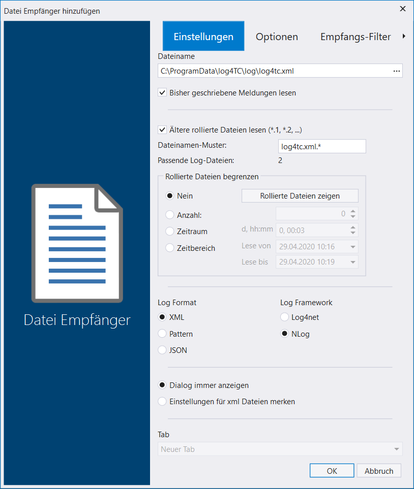
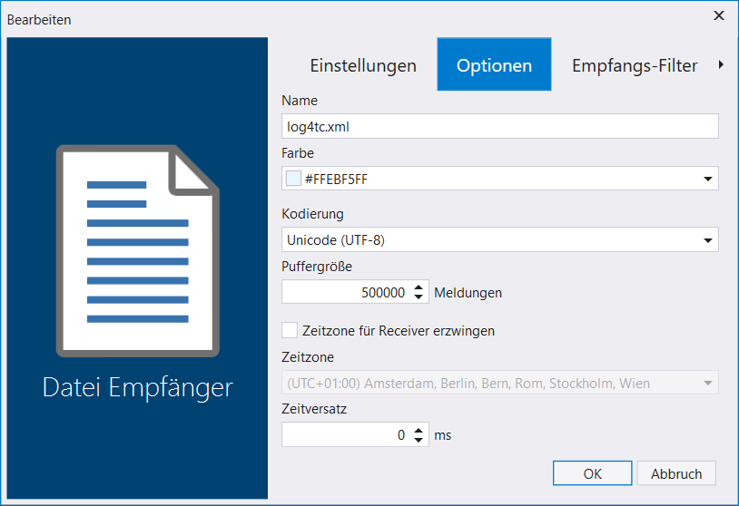

 # Log-Meldungen mit Log4View beobachten

 Für die Ausgabe, Speicherung und Weiterverarbeitung existieren eine fast endlose Anzahl an Werkzeugen, Datenbank, usw.

 Ein einfach zu integrierendes Werkzeug für die Analyse und Anzeige von Log-Meldungen ist das Produkt [*Log4View*](https://www.log4view.com/) von PROSA. Die Anwendung kann mit reduzierten Funktionsumfang kostenlos benutzt werden.

 ## Installation von Log4View

 Die Anwendung kann [Hier](https://www.log4view.de/download-1) heruntergeladen werden. Sie wird wie eine normale Windows Anwendung installiert.

 ## Konfiguration der Log-Ausgabe in NLog

 Log4View kann verschiedene Eingabeformate verarbeiten, aber das Log4J-XML hat sich bisher als sehr geeignet herausgestellt. Die NLog-Konfiguration in der log4TC Auslierferung enthält bereits alles notwendige, damit solche Dateien geschrieben werden. Sie befinden sich im gleichen Ordner `%ProgramData%\log4TC\log\` wie die bisher benutzte `log4tc.log`.
 
 Die Log-Datei für Log4View hat den Namen `log4tc.xml`. Der Inhalt ist XML, kann als prinzipiell in einem Texteditor geöffnet werden, ist aber schwieriger zu lesen.

 ## Öffnen der `log4tc.xml` in LogView

Nach dem Starten von Log4View, kann mit *Start*/*Öffnen* die Log-Datei ausgewählt werden. Am einfachsten geht das, wenn man im Öffnen-Dialog im Pfad folgenden Text hineinkopiert und Enter betätigt: `%ProgramData%\log4TC\log\`. Danach wird die Datei `log4tc.xml` ausgewählt und mit Klick auf *Öffnen* bestätigt.

Jetzt muss noch das Format der Datei eingestellt werden. Die Einstellungen sollten den nachfolgenden Bildschirmfoto entsprechen:

Nach dem Bestätigen mit *OK* wird die Datei geladen und im Fenster angezeigt. Man findet hier alle Informationen, die auch im Log-File waren, aber in strukturierter Form. So kann man z.B. zu einem Zeitstempel springen, Logger ausblenden, Nur bestimmte Level anzeigen, usw.

## Nächster Schritt

[Protokollierung von strukturierten Werten](write_structured_values.md)

