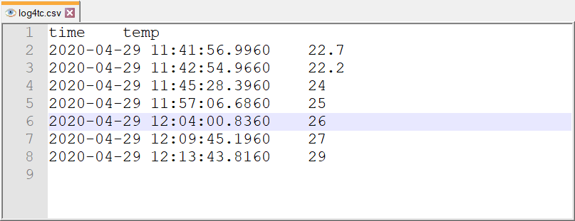

# Protokollierung von strukturierten Werte

log4TC unterstützt das Prinzip von strukturierten Logging (Siehe auch [Message Templates](https://messagetemplates.org/)). Kern des Konzept ist es alle Logging Daten nicht als String zu übertragen und zu verarbeiten sondern in kleinen Fragmenten ihrer Ursprungsform. Der Vorteil ist, dass man während der Verarbeitung der Log-Meldung mehr Möglichkeiten hat. Ein Beispiel wird nachfolgend Beschrieben, bei dem es darum geht, Temperaturen über log4TC in ein CSV-File zu schreiben.

## Aufruf der Meldung mit strukturierter API

Prinzipiell spielt es für log4TC keine Roll wie eine Meldung verarbeitet wird, trotzdem muss man aber als Programmierer schon beim Erzeugen dafür sorgen, dass alle notwendigen Informationen vorhanden sind. Im Beispiel steht in der Variable `fTemp` eine Temperatur, z.B. eines Schaltschranks. Der nachfolgende Code prüft ob sich die Temperatur geändert hat und schreibt diese dann in das Log-File:

```
IF fTemp <> fPrevTemp THEN
	fPrevTemp := fTemp;
	
	F_LogLA1C(
		E_LogLevel.eInfo, 
		sLogger, 
		'Temperatur {temperature}', 
		fTemp, 
		F_LogContext().AddBool('csv', TRUE)
	);
END_IF
```

Dieser Aufruf hat zwei Neuerungen: Zum einen wird für das Temperatur Argument in der Log-Meldung nicht der Platzhalter '{0}' verwendet sondern die strukturierte Form. Der Ausdruck `{temperature}` bedeutet das dieses Argument einen Namen, nämlich *temperature* zugeordnet wird. Zum anderen wird noch eine Context-Eigenschaft mit dem Namen *csv* auf den Wert `TRUE` gesetzt. Der Name und der Wert der Context-Eigenschaft wurde hier willkürlich gewählt, wichtig ist diese nur in Verbindung mit der NLog-Konfiguration.

## Konfiguration von NLog

Das Ausgabe-Plugin *NLog* bietet eine Vielzahl an Funktionen an um Log-Meldungen auszugeben. In diesen Beispiel wird aber nur ein Ausschnitt betrachtet, der für das Verständnis notwendig ist.

Zunächst muss ein sog. `target` eingerichtet werden. Ein `target` ist die Konfiguration einer Ausgabe:

```
<target name="csvLogFile"
		xsi:type="File"
		fileName="${logdir}/log4tc.csv"
		<!-- weitere Optionen -->
		<layout xsi:type="CsvLayout"
				withHeader="true"
				delimiter="Tab">
			<column name="time" layout="${longdate}" />
			<column name="temp" layout="${event-properties:item=temperature}" />
		</layout>
</target>
```

Im Beispiel wird eine Ausgabe in eine Datei (`xsi:type="File"`) konfiguriert, die ein CSV-Layout benutzt. Danach werden zwei Spalten konfiguriert, eine für den Zeitstempel und eine für die Temperatur. Da die Temperatur als strukturiertes Element übergeben wird, kann direkt darauf zugegriffen werden.

Als nächstes dürfen an dieses `target` nur Log-Meldungen weitergeleitet werden, die auch relevant für das CSV sind. Ein Möglichkeit wäre zu prüfen, ob eine Meldung das `temperature` Argument besitzt oder nicht. Um einen anderen Weg zu zeigen wird im Beispiel aber eine Context-Eigenschaft geprüft:

```
<logger name="*" minlevel="Info" writeTo="csvLogFile">
	<filter defaultAction="Ignore">
		<when condition="${event-properties:item=csv})" action="Log" />
	</filter>
</logger>
```

1. Zunäscht werden alle Log-Meldungen Selektiert, die min. den Level `Info` haben.
1. Für diese Meldungen wird geprüft ob eine Context-Eigenschaft mit dem Namen `csv` vorhanden ist und wenn ja wird der Rückgabe-Wert ausgewertet. Ist dieser `true` dann wird die Meldung an die CSV-Ausgabe weitergeleitet
1. Trifft die Bedingung nicht zu, dann wird sie für diesen `Target` ignoriert

## CSV-Ausgabe

Lädt man das Programm und ändert man die Temperatur in der Variable `fTemp` einige Mal, wird eine neue Log-Datei im CSV-Format angelegt mit folgenden Inhalt:



