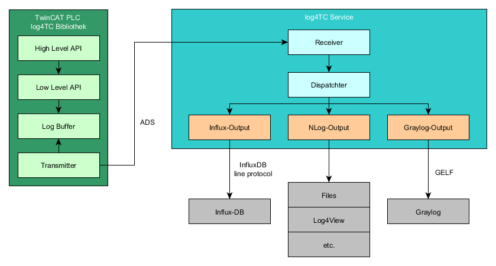
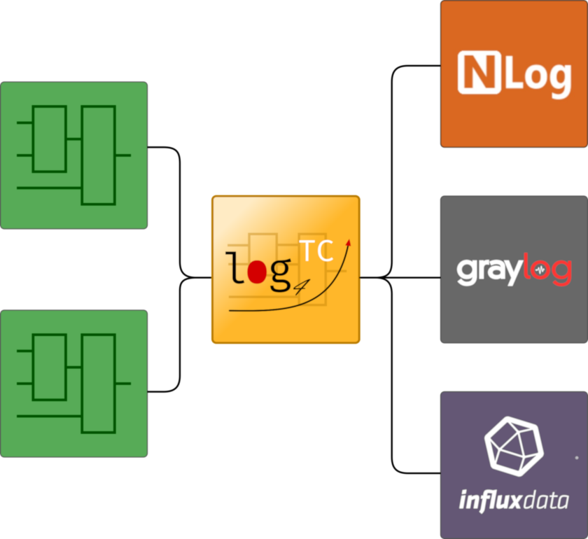

 # mbc log4TC

Log4TC ist eine Erweiterung für TwinCAT3 von Beckhoff, um direkt aus der SPS Logmeldungen
erzeugen zu können. Die Meldungen können transferiert, gefiltert, ausgewertet und an
verschiedene Ausgaben weitergleitet werden.

Log4TC besteht aus zwei Teilen, einer SPS-Bibliothek und einen Windows-Service.

 
 Der log4TC-Service wird normalerweise auf dem Rechner installiert, auf dem auch die SPS läuft, kann aber für bestimmte Einsatzzwecke auch auf einem anderen Rechner für mehrere Steuerung installiert werden.

 **Features**
 * Einfache API für die integration in die SPS
 * Strukturiertes Logging (https://messagetemplates.org/)
 * Unterstützung von Context-Eigenschaften auf verschiedenen Ebenen
 * Performant und Modular
 * Kostenlose Testversion verfügbar
 * Lizenzierung über Beckhoff-Mechanismus in Dongle, Klemme oder PC
 * Unbegrenzte Ausgabemöglichkeiten (Textdatei, Datenbank, Cloud, usw.)

## Ausgaben

Log4TC implementiert Ausgaben über ein Plugin-System. Standardmässig bei der Auslieferung ist die NLog-Ausgabe aktiv. Die Ausgabeplugins werden laufend erweitert, die nächsten Plugins sind Ausgaben für Graylog und InfluxDB.

Bei Bedarf können wir auch kundenspezifische Ausgaben erstellen.

## Typische Anwendungsfälle für log4TC

* Fehlertracking und Alarmierung
* Debugging von sporadischen Fehlern ohne Breakpoints
* Ablaufanalysen bei Problemen auch in Nachhinein
* Statistische Auswertungen, z.B. KPI

## Nächste Schritte

* [Download](https://github.com/mbc-engineering/log4TC/releases/latest)
* [Erste Schritte](gettingstarted/intro.md)
* [Referenz](reference/index.md)

## Firewall

Der Log4TC Service erstellt einen eigenen ADS Server auf den die PLC sich verbindet. Der ADS Server läuft auf Port `16150`. Daher muss die Firewall entsprechend konfiguriert werden damit dieser Port erreichbar ist.