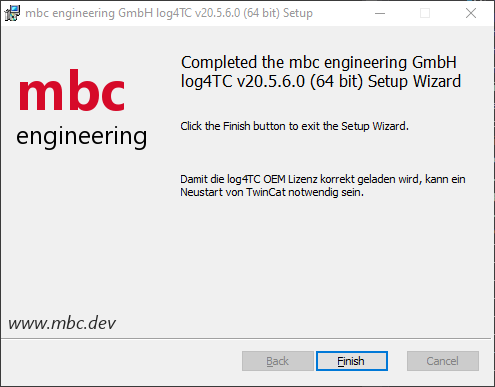
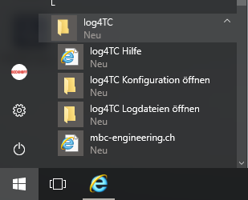
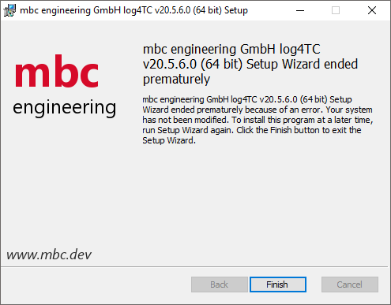

# Installationsanleitung von log4TC

## Setup

Den aktuellen Release von Log4TC kann [hier](https://github.com/mbc-engineering/log4TC/releases) geladen werden. Achten sie auf die Ziel Architektur x86 bzw x64!

## Voraussetzungen

* [TwinCat 3.1 (min. 4024.00)](https://www.beckhoff.com/de-de/suchergebnisse/?q=TE1000+%7C+TwinCAT+3+Engineering)
* Administrationsrechte für die Installation

**Nur Service:**

* min Windows 10 - 1607
* [ADS Router - TC1000 | TC3 ADS](https://www.beckhoff.com/de-de/support/downloadfinder/suchergebnis/?download_group=97028369)
* [Verwendet Microsoft .NET 8 (muss nicht installiert werden)](https://github.com/dotnet/core/blob/main/release-notes/8.0/supported-os.md)

## Beispiel Installation

Vorgehen zur Installation auf einem Zielsystem wie einem C6015 mit Windows 10 und einer x64 Architektur.

1. Stellen Sie sicher das alle Anwendungen geschlossen sind.
2. Kopieren des MSI [Mbc.Log4Tc.Setup.Wix.x64.vxx.xx.xx.msi](https://github.com/mbc-engineering/log4TC/releases) auf den Zielrechner. Führen Sie das MSI setup aus.
3. Akzeptieren Sie den `log4TC Software-Lizenzvertrag`.
4. Wählen sie die gewünschten Features. Nähere Beschreibeung [hier](#features)
4. Durch Klicken auf `Install` werden alle notwendigen Dateien auf das System kopiert und der log4TC Windows Service mit dem Namen `mbc log4TC Service` gestartet.

## Features

### log4TC Service

> [!NOTE]
> Dieses Feature erscheint nur wenn sie ein ADS Router - TC1000 | TC3 ADS installiert haben.

**Beinhaltet**

- Windows Service zum schreiben der generierten Logmeldungen aus TwinCat
- Konfiguration Links im Startmenü

### log4TC TwinCat 3 Bibliothek

> [!NOTE]
> Dieses Feature erscheint nur wenn sie TwinCat 3.1 Engineering (XAE) min. 4024.00 installiert haben.

**Beinhaltet**

- Installiert die log4TC Twincat 3 Bibliothek lokal
- Bereitet die OEM Lizenz zur Registrierung für die Produktive Benutzung vor
- Kopiert das getting starded Projekt unter `C:\ProgramData\log4TC\gettingstarded`
- Hilfe Links im Startmenü

## Bekannte Fehler

## Setup endet mit dem Fehler: `... Setup Wizard endet prematurely because of an error. Your system has not been modified. ...`

In diesem Fall ist ein Fehler aufgetreten.

Starten sie das setup erneut mit der Kommandozeile ausgeführt als Administrator. Navigieren Sie in den Ortner mit dem MSI Setup per `cd [folder]`. Geben Sie folgendes ein: `msiexec.exe /i "[setup].msi" /l*v install.log`. Wenden Sie sich anschliessend mit dem `install.log` an uns.
