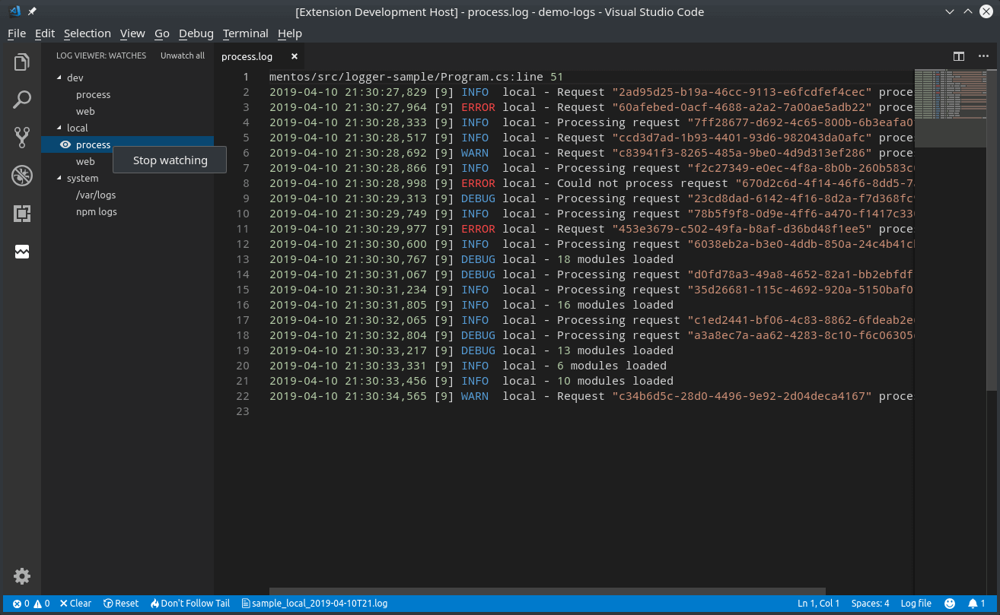

# Werkzeuge rund um log4TC

## Anzeigen von Log-Meldungen

### Log4View

Die Anwendung [Log4View](https://www.log4view.com/) von Prosa ist eine unserer Empfehlungen für die Anzeige von mittleren oder grossen Anzahl an Log-Meldungen. Selbst die konstenlose Variante ist für viele Zwecke ausreichend.

Wichtig bei der Benutzung von Log4View mit log4TC sind folgende Punkte:

#### NLog Konfiguration

NLog muss für die log4j-XML Ausgabe konfiguriert werden. NLog kommt mit einem Standard-Layout `log4jxmlevent`, das prinzipiell diese Anforderung erfüllt. log4TC stellt aber eine erweiterte Variante `mbclog4jxmlevent` mit folgenden Verbesserungen zur Verfügung:
* Thread-Id enthält die SPS Task-ID
* Zusätzliches Properties um die Message zu formatieren

Eine Beispiel-Konfiguration könnte so aussehen:

```xml
  <extensions>
    <add assembly="Mbc.Log4Tc.Output.NLog"/>
  </extensions>

  <targets>
    <target name="xmlLogFile"
            xsi:type="File"
            encoding="utf-8"
		    fileName="${logdir}/log4tc.xml"
            <!-- evtl. weiter File Optionen -->
			layout="${mbclog4jxmlevent:includeAllProperties=true:message=${message} [${mbc-all-event-properties}]}">
    </target>
```

#### Logging

Log4View bietet sehr gute Selektionsmöglichkeiten auf dem Logger und dem Level. Es lohnt sicher daher diese beiden Konsequenzt im Code einzusetzen.

Leider bietet Log4View bis jetzt noch keine Unterstützung von Context-Properties und/oder structured Logging.

### Notepad++

[Notepad++](https://notepad-plus-plus.org/) bietet zwar keinen speziellen Modus für log4TC besitzt aber zwei Eigenschaften, die es interssant mach für einfache Logging Aufgaben:

* Im Menü "Ansicht" -> "Überwachen (tail -f)" kann Notepad++ angewiesen werden die Log-Datei laufend zu überwachung und bei Änderung automatisch einzulesen.
* Im Menü "Sprachen" kann nach eigenen Anforderungen ein Stil defineirt werden, wie die einzelnen Blöcke in einem Log-File formatiert werden sollen

### Visual Studio Code

[Visual Studio Code](https://code.visualstudio.com/) ist ähnlich wie Notepad++ eine universelle Platzform für Textverarbeitung. VS-Code bietet eine grosse Anzahl an Erweiterungen so z.B. auch für Log-File.

Eines davon *Log Viewer* bietet einfache Möglichkeiten für Log-Files:




### TODO

* https://www.logviewplus.com/
* Compact Log Viewer in Verbindung CLEF-Format