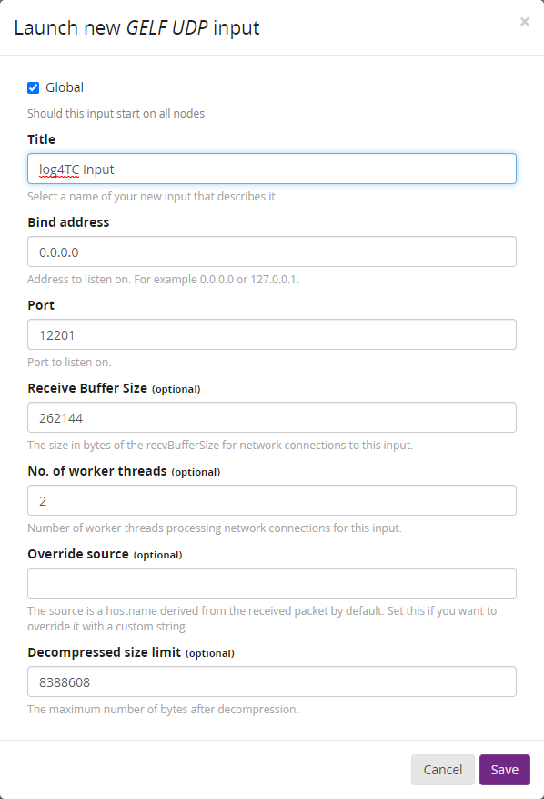

# Logging nach Graylog

## Einleitung

Dieser Unter-Ordner enthält ein Beispielprojekt (SPS und Docker) um aus einer TwinCAT-SPS zu einem [Graylog-Server](https://www.graylog.org/) zu loggen.

## Vorraussetzungen

### Beispieldateien

Die Beispiele können mit `git clone https://github.com/mbc-engineering/log4TC.git` oder mit dem Download auf [log4TC](https://github.com/mbc-engineering/log4TC) heruntergeladen werden. Dieses Beispiel inkl. SPS-Projekt befindet sich im Unterordner `graylog`. 

* `Plc/`: Dieses Verzeichnis enthält den TwinCat SPS Code für das Beispiel. Er kann ohne Hardware ausgeführt werden.
* `appsettings.json`: Konfigurationsdatei für den log4TC-Service.
* `docker-compose.yml`: Docker-Compose Konfiguration um Influx und Chronograf zu starten.

### Graylog

Graylog wird über Docker gestartet, daher muss Docker (z.B. [Docker Desktop](https://www.docker.com/products/docker-desktop)) installiert sein.

> Wichtig: Docker Desktop läuft nicht zusammen mit der TwinCAT-Runtime. 

Gestartet werden die Container wie folgt:
* Kommandozeile öffnen
* In das Verzeichnis wechseln, in dem sich `docker-compose.yml` befindet
* `docker-compose up -d` Ausführen

Docker startet die notwendigen Dienste für Graylog und stellt unter http://dockerhost:9001 (wenn Docker lokal läuft http://localhost:9001) eine Web-Anwendung zur Verfügung.

> Hinweis: Der Start von Graylog kann einige Minuten dauern.

Damit Graylog Meldungen vom log4TC-Service empfangen kann, muss zuerst ein Input konfiguriert werden:

1. Menü *System* -> *Inputs*
2. "GELF UDP" auswählen -> "Launch new input"

### Konfiguration log4TC Service

Auf einem Rechner (z.B. auf dem Graylogläuft) muss log4TC installiert sein. Für dieses Beispiel kann die Konfiguration `appsettings.json` in den Ordner `%ProgramData%\log4TC\config` kopiert werden. Sofern log4TC **nicht** auf den gleichen Rechner läuft wie die Docker-Container, müssen in der Konfiguration die Zeilen `"GraylogHostname": "localhost"` angepasst werden. Danach sollte der log4TC Service (Neu-)gestartet werden.

### SPS-Projekt

Im Unter-Ordner `Plc` befindet sich ein Beispiel SPS-Projekt das einige simulierte Log-Meldungen absetzt. Falls die SPS auf einem anderen Rechner als der log4TC-Service läuft, muss zwischen den beiden Rechnern eine Route eingerichtet werden. Im `MAIN`-Baustein muss in der Zeile `PRG_TaskLog.Init('192.168.56.1.1.1');` die AMS-Net-ID des log4TC-Service Rechners eingetragen werden. Läuft der log4TC-Service auf dem gleichen Rechner wie die SPS, kann dieses Zeile entfernt werden.

Das Projekt kann danach aktiviert und gestatet werden. Während der Ausführung werden folgende Log-Meldungen geschrieben:

* `MAIN`: Beim Start wird einmalig eine Message ausgeben, dass die SPS läuft.
* `FB_LogTaskCycleTime`: Loggt alle 10s die durchschnittliche, maximale und minimale Zykluszeit. Für diesen Zweck wird mit `PRG_SimulateLoad` ein Programm simuliert.
* `PRG_SimulateLogs`: Schreibt zufallsgeneriert Log-Meldungen z.T. mit Error-Codes.

## Logs-Auf Graylog

