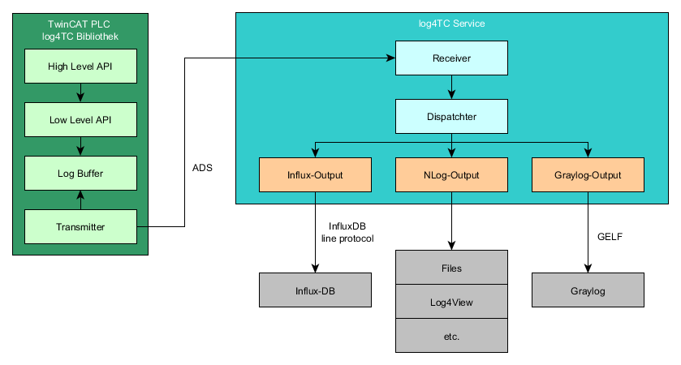
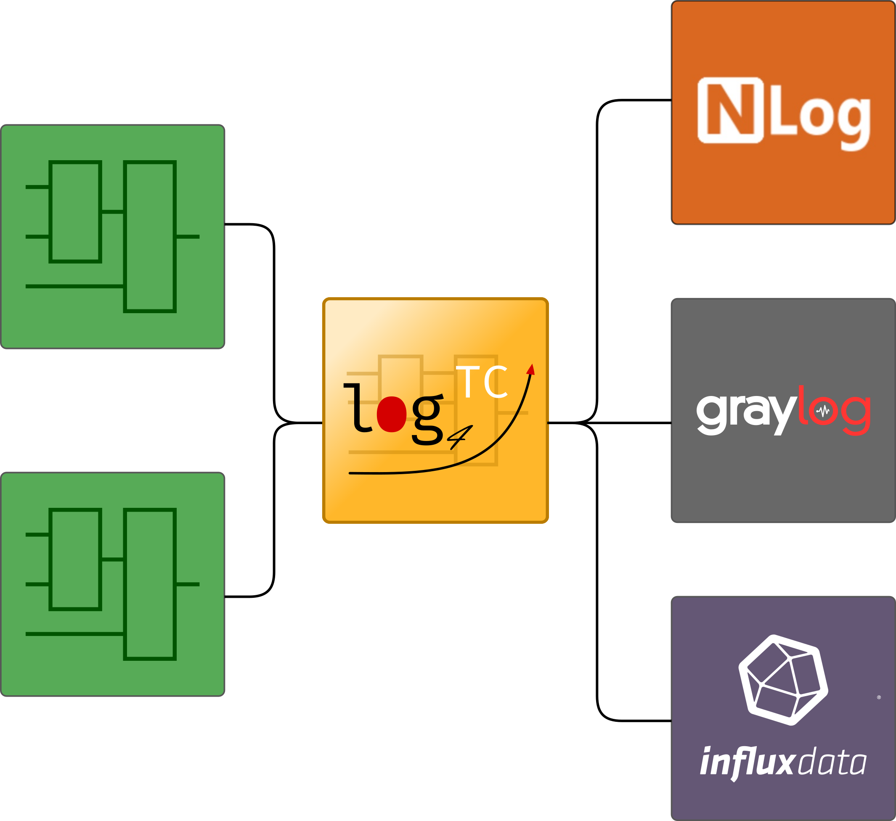

# mbc log4TC

Log4TC is an extension for TwinCAT3 by Beckhoff, allowing the generation of log messages directly from the PLC (Programmable Logic Controller). The messages can be transferred, filtered, evaluated, and forwarded to various outputs.

Log4TC consists of two parts: a PLC library and a Windows service.

The log4TC service is typically installed on the same computer as the PLC, but for specific use cases, it can also be installed on a different computer for multiple controllers.

**Features**
* Simple API for integration into the PLC
* Structured logging (https://messagetemplates.org/)
* Support for context properties at various levels
* Efficient and modular
* Free trial version available
* Licensing through Beckhoff mechanism in dongle, terminal, or PC
* Unlimited output possibilities (text file, database, cloud, etc.)

## Outputs

Log4TC implements outputs through a plugin system. By default, NLog output is active upon delivery. Output plugins are continuously expanded, with upcoming plugins for Graylog and InfluxDB.

We can also create custom outputs upon request.

## Typical use cases for log4TC

* Error tracking and alerting
* Debugging sporadic errors without breakpoints
* Sequence analysis in case of issues, even retrospectively
* Statistical analysis, e.g., KPI

## Next Steps

* [Download](https://github.com/mbc-engineering/log4TC/releases/latest)
* [Getting Started](gettingstarted/intro.md)
* [Reference](reference/index.md)
