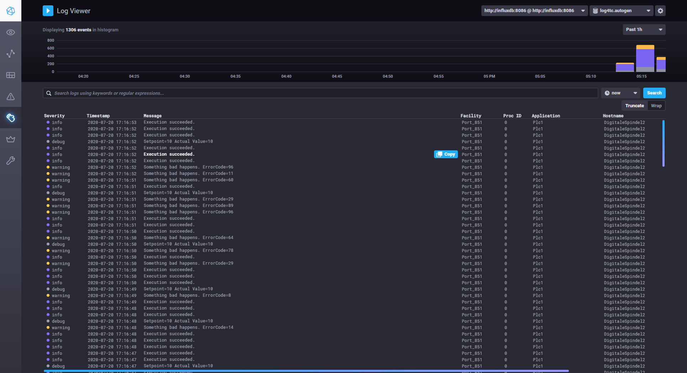
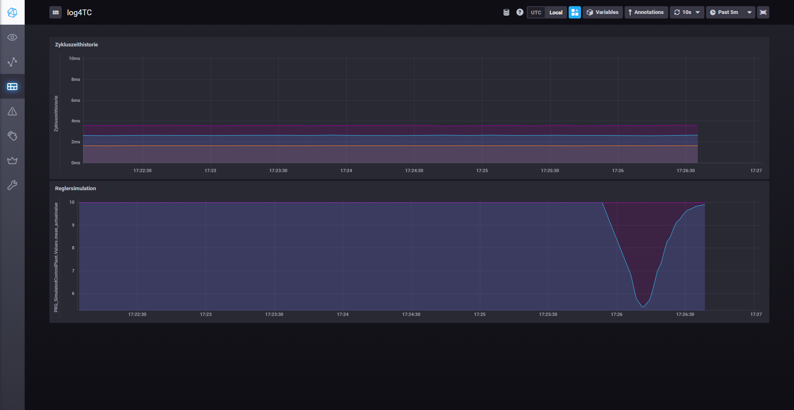

# Logging nach Influx

## Einleitung

Dieser Unter-Ordner enthält ein Beispielprojekt (SPS und Docker) um aus einer TwinCAT-SPS in eine Influx-DB zu schreiben und die Daten in Chronograf zu visualisieren. In der SPS werden dazu einige simulierte Logmeldungen mit und ohne strukturierte Argumente abgesetzt. Das Beispiel zeigt ausserdem wie Influx mit kompletten Log-Meldungen im Syslog-Format umgeht.

## Vorraussetzungen

### Beispieldaten

Die Beispiele können mit `git clone https://github.com/mbc-engineering/log4TC.git` oder mit dem Download auf [log4TC](https://github.com/mbc-engineering/log4TC) heruntergeladen werden. Dieses Beispiel inkl. SPS-Projekt befindet sich im Unterordner `influx_with_message`. 

* `Plc/`: Dieses Verzeichnis enthält den TwinCat SPS Code für das Beispiel. Er kann ohne Hardware ausgeführt werden.
* `appsettings.json`: Konfigurationsdatei für den log4TC-Service.
* `docker-compose.yml`: Docker-Compose Konfiguration um Influx und Chronograf zu starten.
* `log4TC.json`: Chronograf Dashboard-Export für das Beispiel.

### Influx und Chronograf

Influx und Chronograf werden über Docker gestartet, daher muss Docker (z.B. [Docker Desktop](https://www.docker.com/products/docker-desktop)) installiert sein.

> Wichtig: Docker Desktop läuft nicht zusammen mit der TwinCAT-Runtime. 

Gestartet werden die Container wie folgt:
* Kommandozeile öffnen
* In das Verzeichnis wechseln, in dem sich `docker-compose.yml` befindet
* `docker-compose up -d` ausführen

Docker startet Influx und legt dabei drei Datenbanken an (siehe `initdb.iql`). Danach wird noch Chronograf gestatet, das eine Weboberfläche auf der Adresse http://dockerhost:8888 (wenn Docker lokal läuft http://localhost:8888) zur Verfügung stellt.

### Konfiguration log4TC Service

Auf einem Rechner (z.B. auf dem Influx und Chronograf läuft) muss log4TC installiert sein. Für dieses Beispiel kann die Konfiguration `appsettings.json` in den Ordner `%ProgramData%\log4TC\config` kopiert werden. Sofern log4TC **nicht** auf den gleichen Rechner läuft wie die Docker-Container, müssen in der Konfiguration die Zeilen `http://localhosthost:8086` angepasst werden. Danach sollte der log4TC Service (Neu-)gestartet werden.


### SPS-Projekt

Im Unter-Ordner `Plc` befindet sich ein Beispiel SPS-Projekt das einige simulierte Log-Meldungen absetzt. Falls die SPS auf einem anderen Rechner als der log4TC-Service läuft, muss zwischen den beiden Rechnern eine Route eingerichtet werden. Im `MAIN`-Baustein muss in der Zeile `PRG_TaskLog.Init('192.168.56.1.1.1');` die AMS-Net-ID des log4TC-Service Rechners eingetragen werden. Läuft der log4TC-Service auf dem gleichen Rechner wie die SPS, kann dieses Zeile entfernt werden.

Das Projekt kann danach aktiviert und gestatet werden. Während der Ausführung werden folgende Log-Meldungen geschrieben:

* `MAIN`: Beim Start wird einmalig eine Message ausgeben, dass die SPS läuft.
* `FB_LogTaskCycleTime`: Loggt alle 10s die durchschnittliche, maximale und minimale Zykluszeit. Für diesen Zweck wird mit `PRG_SimulateLoad` ein Programm simuliert.
* `PRG_SimulatedControlPlant`: Simuliert einen PI-Regler mit Regelstrecke. Es werden fehler im PI-Regler geloggt und wenn der Zielwert verlassen oder erreicht wird. Ausserdem wird jede Sekunde der Ist- und Sollwert geschrieben.
* `PRG_SimulateLogs`: Schreibt zufallsgeneriert Log-Meldungen z.T. mit Error-Codes.

## Logs auf Influx/Chronograf

Über die log4TC-Konfiguration

```json
    {
      "Type": "influxdb",
      "Config": {
        "Url": "http://localhost:8086",
        "Database": "log4tc",
        "Format": "syslog"
      }
    }
```

Werden alle Log-Meldungen in die Datenbank `log4tc` im Syslog-Format geschrieben (dies ist Vorraussetzung für die Anzeige).

In Chronograf (z.B. http://localhost:8888/logs) werden diese Logmeldungen als Liste und als Balken-Chart angezeigt.



## Logs mit Werten in Chronograf-Charts

Die anderen beiden Ausgaben in der log4TC-Konfiguration schreiben bestimmte Log-Meldungen in separate Datenbanken zur Anzeige in einem Chart.


```json
    {
      "Type": "influxdb",
      "Filter": { "Logger": "FB_LogTaskCycleTime" },
      "Config": {
        "Url": "http://localhost:8086",
        "Database": "cycletime",
        "Format": "arguments"
      }
    },
    {
      "Type": "influxdb",
      "Filter": { "Logger": "PRG_SimulatedControlPlant.Values" },
      "Config": {
        "Url": "http://localhost:8086",
        "Database": "controlplant",
        "Format": "arguments"
      }
    }
```

Das Format `arguments` bewirkt hier, dass nicht die Log-Meldung selbst, sondern die (strukturierten) Argumente der Log-Meldungen in Influx geschrieben werden.

In der Datei `log4TC.json` ist ein vorbereitetes Dashboard mit zwei Charts als Beispiel. Diese Datei wird in Chronograf (http://localhost:8888/sources/0/dashboards) mit *Import Dashboard* importiert.




